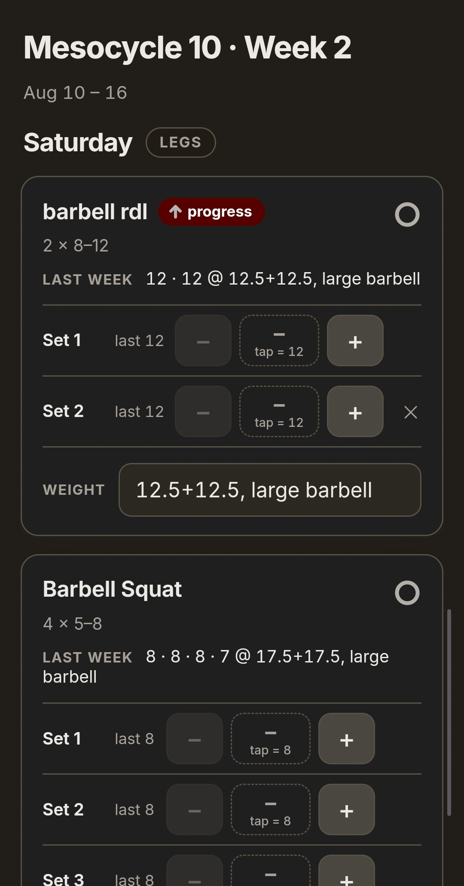
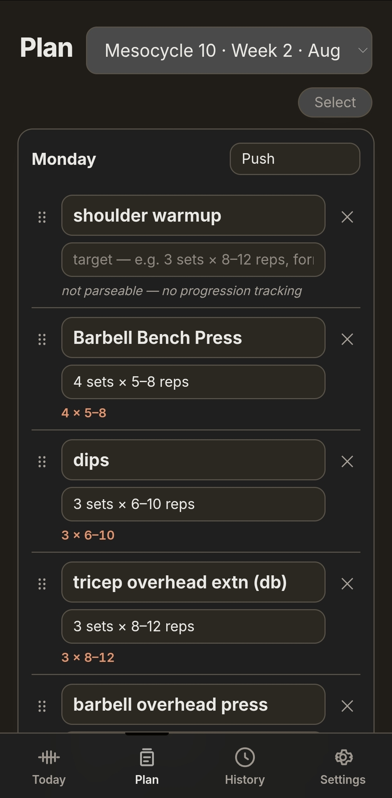
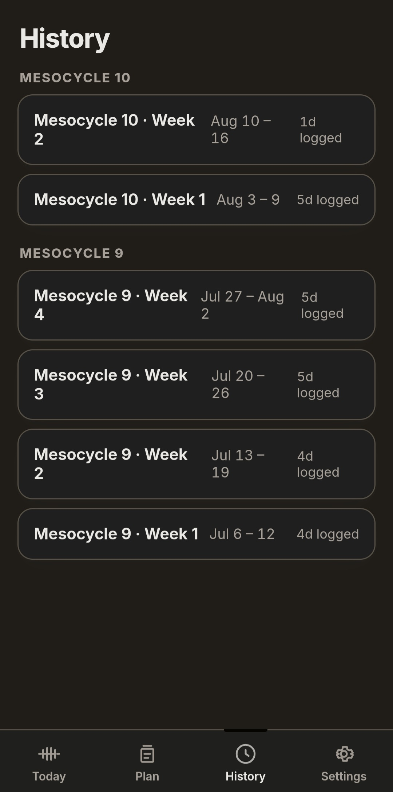
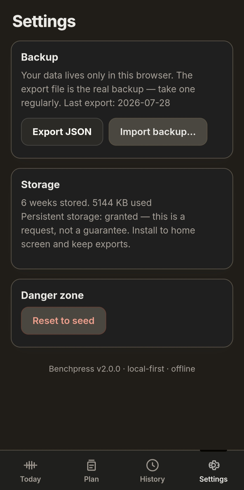

# Benchpress

<p>
  
  
  
  
</p>

A personal workout tracker, built to match one training system — not a general-purpose gym app.

Local-first PWA: all data lives in IndexedDB on the device, works fully offline, no server, no account. It mirrors the mesocycle → week → day → exercise structure of a Google Sheet, marks exercises for progression, and rolls the plan forward every week automatically.

## Quick start

```bash
npm install
npm run dev            # http://localhost:5199
```

Use it on your phone (same Wi-Fi): `npm run dev` prints a Network URL — open that, then **Add to Home Screen** to install it as an offline app. Installing is what makes storage persistent, so do it before logging real workouts.

> Shell note (this machine): npm installs need
> `env -u npm_config_allow_scripts -u npm_config_local_prefix npm install`.

## Commands

```bash
npm run dev          # dev server (supports ?today=YYYY-MM-DD to test week rollover)
npm test             # 88 unit tests (runs under TZ=America/New_York to exercise DST)
npm run build        # tsc + vite build + service worker (offline PWA)
npm run preview      # serve the production build locally
npm run build-seed   # regenerate src/seed/seed.json from fixtures/mesocycle_9.csv
npm run gen-icons    # regenerate public/icon-*.png
```

## How it works

- **Week documents** — one IndexedDB record per week (`id` = local Monday, `YYYY-MM-DD`), holding all 7 days and their ordered exercises. Every read is a whole week plus one previous-week lookup, so there are no normalized tables. All mutations are targeted read-modify-write transactions in `src/db/repo.ts` (never whole-doc writes from stale UI state).
- **Targets** (`src/domain/target.ts`) — parsed from the free-text description: `4 sets × 5–8 reps`, `3 × 6–10`, fixed `3 × 8`, and superset sums like `1 set + 1 set + 1 set x 10–15`. Unparseable text (`shoulder warmup`, `2–3 sets`) is progression-ineligible.
- **Progression** (`src/domain/progression.ts`) — an exercise shows **↑ progress** next week when last week's matching exercise hit the **top** of its rep range on every prescribed set. Matching is one-to-one: `sourceId` lineage first (a rename intentionally breaks the badge), then same-day name, then week-unique name. Weights are never predicted — the app only tells you *when* to add weight, never how much.
- **Rollover** (`src/domain/rollover.ts`) — on first open on/after Sunday, the latest week is deep-copied into the new week, so plan edits (add/remove/rename/reorder) carry forward automatically. Logged weights become next week's "last week" reference. Multi-week gaps do a single jump (no phantom skipped weeks); week/meso numbers count *trained* weeks. 4 weeks = 1 mesocycle; after week 4 the next is Mesocycle N+1, Week 1.
- **Seed** — Mesocycle 9 from the Google Sheet, parsed once by `scripts/build-seed.ts` into the committed `src/seed/seed.json`. The app never parses CSV at runtime; regenerate with `npm run build-seed` after editing the fixture.
- **Backup** — Settings → Export JSON. That file is the real backup; browsers can evict IndexedDB. Import validates the structure and auto-downloads a pre-import backup before replacing anything.

## Screens

- **Today** — swipe or tap between days; each exercise is a card with the target, last week's reps + weight, and a labeled row per set. Tap an empty set to log the top of the range, `−`/`+` to adjust, `✕` to clear. Weight is pre-filled from last week and editable. Hitting the top on every set lights up the progress badge with a haptic.
- **Plan** — edit the plan for any week (defaults to the latest): rename exercises, edit targets (with a live parse hint), add/remove/reorder, set the day's split. Edits to the latest week carry forward on the next rollover.
- **History** — every week grouped by mesocycle, read-only with an "edit logs" toggle for fixing past entries.
- **Settings** — export/import/reset, storage persistence status.

## Stack

Vite · React + TypeScript (strict) · Dexie (IndexedDB) with `useLiveQuery` · Motion for animation · vite-plugin-pwa · Inter (bundled, offline) · Vitest. The entire `src/domain/` layer is pure and framework-free.

## Design

Porcelain light theme — warm paper background, ink text, a single terracotta accent used only for meaning (progression, today, top-of-range). Motion is deliberately restrained: short GPU-only transitions, with the progression moment as the one flourish.
